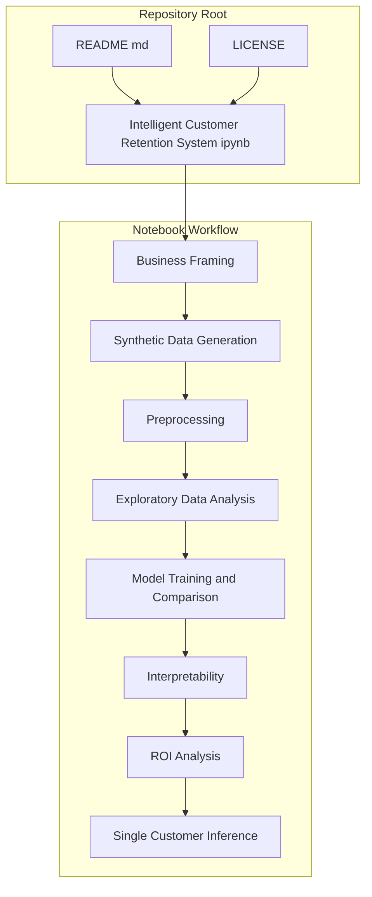
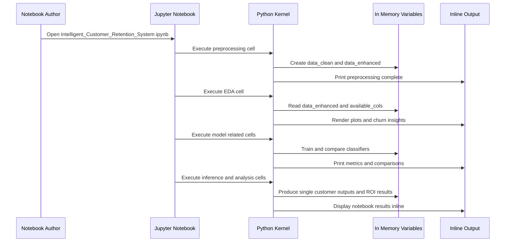

# Project Architecture and Repository Structure

## Overview

This repository is intentionally compact and notebook-centric. In the provided repository evidence, the root directory contains exactly three artifacts: `README.md`, `LICENSE`, and `Intelligent_Customer_Retention_System.ipynb`. That layout makes the notebook the primary implementation artifact, while the README and license file provide lightweight project framing and legal terms.

The architecture is defined by a single executable notebook rather than by a multi-package application. The notebook carries the full customer churn workflow end to end, including business framing, synthetic telecom-style data generation, preprocessing, exploratory data analysis, model training and comparison, interpretability, ROI analysis, and single-customer inference. As a result, the repository boundary is cell-driven and analysis-driven, not service-driven or package-driven.

## Architecture Overview

## Repository Layout and Implementation Boundaries

### Root Repository Footprint

The indexed repository root exposes a notebook-first implementation surface: Intelligent_Customer_Retention_System.ipynb is the canonical behavior artifact, and there is no separate src/, tests/, requirements.txt, deployment manifest, or service entrypoint in the repository evidence. Engineers should reason about reuse, testing, and operational readiness from the notebook boundary, not from a modular application layout.

The repository root is limited to three files in the supplied evidence. Each file has a distinct boundary role.

| Path | Type | Responsibility | Boundary Implication |
| --- | --- | --- | --- |
| `README.md` | Markdown | Brief project summary and business intent | Documentation only; no executable logic |
| `LICENSE` | License text | MIT license terms and disclaimer | Legal boundary only |
| `Intelligent_Customer_Retention_System.ipynb` | Jupyter notebook | Full churn prediction and retention workflow | Primary implementation and runtime boundary |

### Implementation Boundary

The implementation boundary is the notebook itself.

- Execution is notebook-cell based, not package-import based.
- State is carried forward inside the notebook kernel between cells.
- The workflow is authored as a linear analytical pipeline rather than as separate services or libraries.
- Reuse happens at the notebook or cell level, not through a repository-local `src/` package.

### Notebook as the Primary Artifact

`Intelligent_Customer_Retention_System.ipynb` is the only file in the repository evidence that contains executable project behavior. The visible notebook content confirms a staged analytical flow with section headers and sequential cells.

The notebook evidence shows these implementation patterns:

- preprocessing output is assigned to `data_enhanced` from `preprocessor.feature_engineering(data_clean)`
- exploratory analysis uses `data_enhanced` as the shared dataset for plots and business insight calculations
- model-related imports are defined inside notebook cells, including preprocessing, model, metrics, and pipeline utilities
- notebook outputs are rendered inline through Jupyter execution rather than through a deployed API or application shell

### Repository-Level Documentation

#### `README.md`

*`README.md`*

`README.md` provides a short project statement that frames the goal as predicting which customers are likely to stop using a service so the business can act to retain them. It does not define runtime behavior, component boundaries, or operational entrypoints.

#### `LICENSE`

*`LICENSE`*

`LICENSE` contains the MIT License text and copyright notice. It establishes the legal terms for using, copying, modifying, and distributing the software.

#### `Intelligent_Customer_Retention_System.ipynb`

*`Intelligent_Customer_Retention_System.ipynb`*

The notebook is the implementation artifact for the churn prediction system. The visible cell content shows:

- sectioned analysis flow, including `SECTION 1: PROBLEM UNDERSTANDING` and `SECTION 4: EXPLORATORY DATA ANALYSIS (EDA)`
- preprocessing code that produces `data_enhanced`
- EDA code that inspects available columns, computes churn counts, and builds plots
- model-oriented imports for classification, preprocessing, imbalance handling, metrics, and plotting

## Notebook Runtime Dependencies

The notebook boundary is backed by an inline analytics stack rather than by repository-managed service code.

| Library Family | Visible Role in the Notebook |
| --- | --- |
| `pandas` | Tabular data handling and feature manipulation |
| `NumPy` | Numeric operations and array support |
| `scikit-learn` | Preprocessing, model training, metrics, and pipelines |
| `imbalanced-learn` | Class imbalance handling with `SMOTE` and `ImbPipeline` |
| `xgboost` | Gradient-boosted tree classification with `XGBClassifier` |
| `Matplotlib` | Static plots for EDA |
| `Seaborn` | Statistical visualization and plot styling |
| `Plotly` | Interactive charts and notebook rendering |
| Jupyter / IPython | Notebook execution and inline output display |

## Notebook Execution Flow

The notebook behaves as a sequential analysis runbook. A single kernel session carries state from one stage to the next.

## State Management

The repository uses notebook kernel state rather than external persistence.

- `data_clean` feeds the preprocessing stage.
- `data_enhanced` becomes the shared dataset for EDA and later analysis.
- `available_cols`, `existing_numeric`, `churn_counts`, and other cell-local variables support plot generation and insight calculations.
- Execution order matters because later cells depend on variables created earlier in the notebook.

### Defensive Runtime Checks

The notebook includes conditional checks that shape execution based on the data available in memory.

- `if len(existing_numeric) > 1` determines whether a correlation heatmap can be drawn.
- `if 'Contract' in data_enhanced.columns` guards contract-based churn calculations.
- Fallback output is rendered when numeric columns are insufficient for correlation analysis.

## Error Handling

The visible notebook code handles analysis-time constraints with conditional branches instead of exceptions or service-level error responses.

- If correlation inputs are insufficient, the notebook prints an informational message instead of trying to render an invalid heatmap.
- If a column such as `Contract` is absent, downstream group-based churn summaries are skipped.
- This keeps the notebook execution resilient to missing or incomplete columns during exploratory work.

## Dependencies and Operational Boundaries

The repository is designed for notebook execution in a Python data science environment.

- It depends on interactive notebook execution, not on an application server.
- It depends on inline plotting and notebook rendering, not on a frontend package or deployed UI.
- It depends on kernel state persistence across cells, so rerunning cells out of order changes behavior.
- It does not expose a reusable service boundary, so engineers should treat the notebook as the source of truth for both logic and analysis output.

## Key Classes Reference

| Class | Responsibility |
| --- | --- |
| `README.md` | Repository summary and business framing |
| `LICENSE` | MIT license terms and copyright notice |
| `Intelligent_Customer_Retention_System.ipynb` | Full customer churn prediction and retention workflow |
